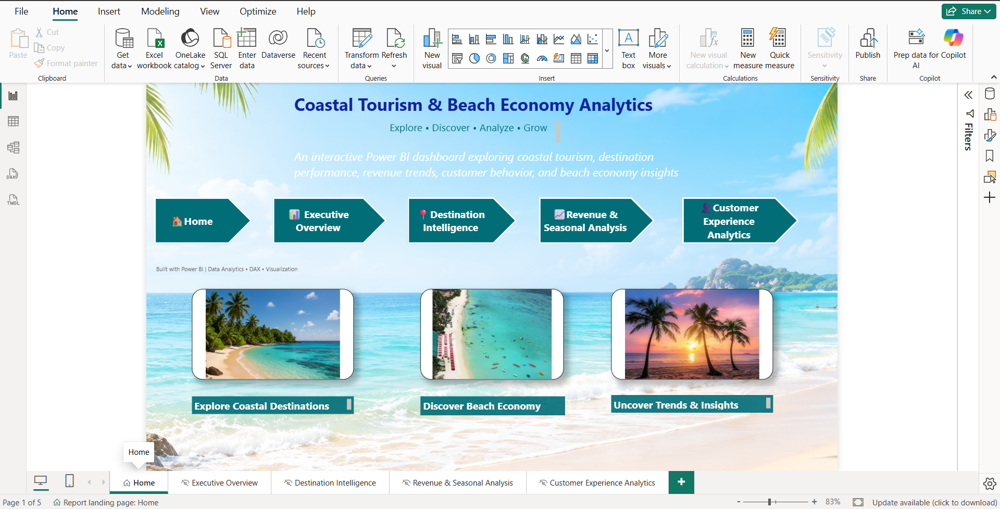
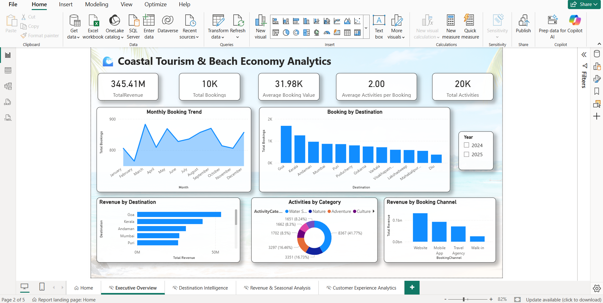
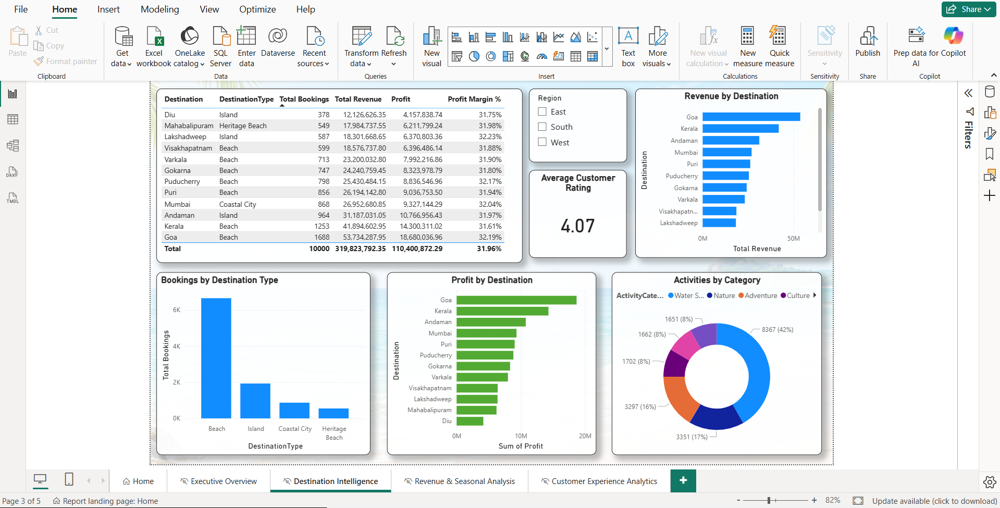
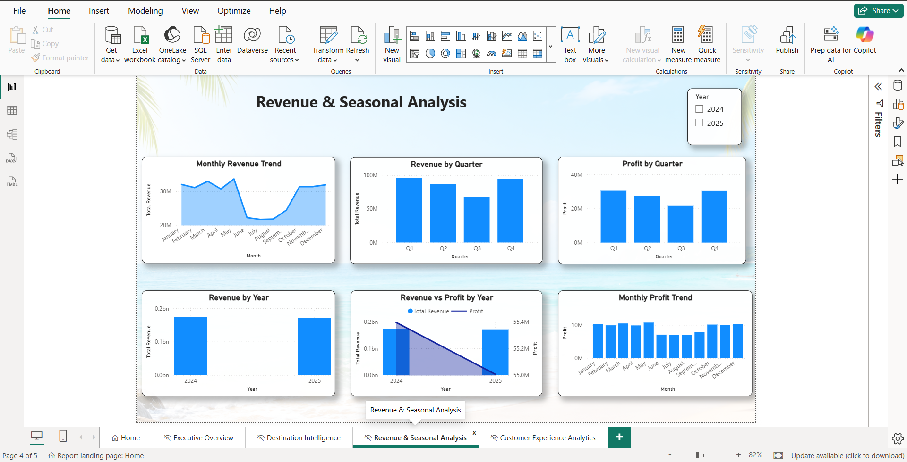
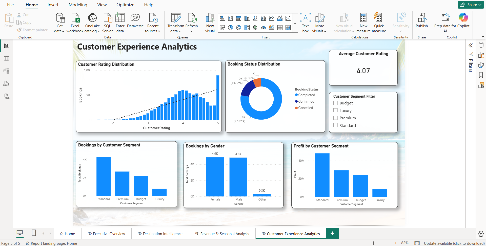

# 🌊 Coastal Tourism & Beach Economy Analytics

An interactive Power BI dashboard designed to analyze coastal tourism performance, destination trends, revenue, customer behavior, and beach economy insights.

## 📊 Project Overview

This project uses Power BI to explore tourism booking data and identify meaningful patterns across destinations, customers, activities, revenue, and profitability.

The dashboard provides interactive visualizations and filters to support data-driven analysis.

## 🎯 Key Objectives

- Analyze overall tourism bookings and revenue
- Compare destination performance
- Understand seasonal revenue trends
- Analyze customer behavior and segments
- Explore customer ratings and booking status
- Analyze activities and booking channels
- Identify profitable destinations and customer segments

## 📈 Dashboard Pages

1. **Home**
2. **Executive Overview**
3. **Destination Intelligence**
4. **Revenue & Seasonal Analysis**
5. **Customer Experience Analytics**

## 🔍 Key Analysis

- Total Revenue
- Total Bookings
- Average Booking Value
- Total Activities
- Average Activities per Booking
- Monthly Booking Trends
- Revenue by Destination
- Bookings by Destination Type
- Revenue by Booking Channel
- Revenue and Profit Trends
- Customer Rating Distribution
- Bookings by Customer Segment
- Bookings by Gender
- Profit by Customer Segment
- Booking Status Distribution

## 🛠️ Tools & Technologies

- Power BI
- DAX
- Power Query
- Microsoft Excel
- Data Visualization
- Data Analysis

## 🔄 Project Workflow

**Data Collection → Data Cleaning → Data Transformation → Data Modeling → DAX Measures → Dashboard Design → Analysis & Insights**

## 💡 Skills Demonstrated

- Data Cleaning
- Data Transformation
- Data Modeling
- DAX Calculations
- Interactive Dashboard Design
- Data Visualization
- Business Analysis
- Analytical Storytelling

## 📂 Dataset

The dataset contains booking, customer, destination, activity, accommodation, and date information used to build the Power BI data model.

## 👩‍💻 Author

**Priya Piyasekar**

Data Analyst | Statistics Graduate | Power BI | SQL | Excel | Python | R

## 📸 Dashboard Screenshots

### 🏠 Home

### 📊 Executive Overview

### 📍 Destination Intelligence

### 📈 Revenue & Seasonal Analysis

### 👤 Customer Experience Analytics

